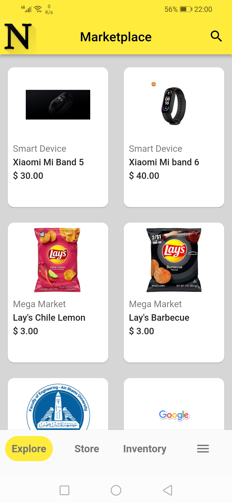
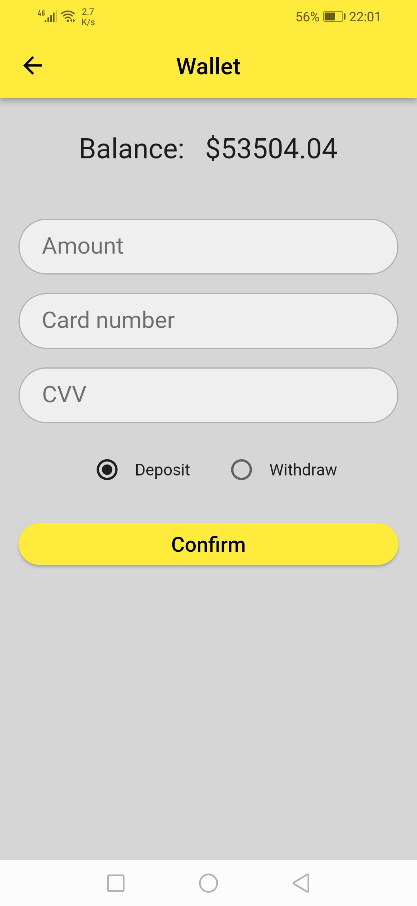
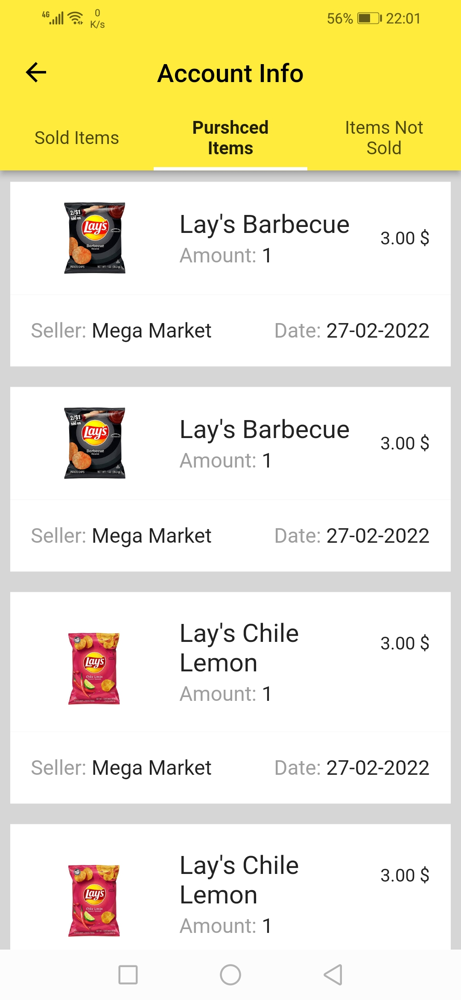
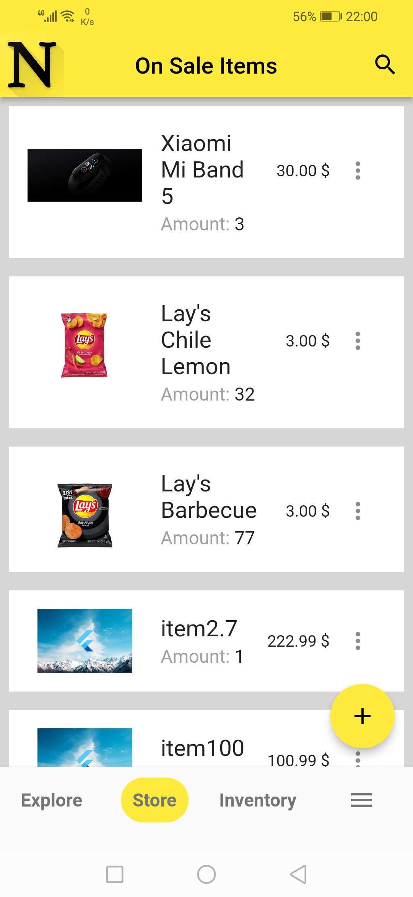
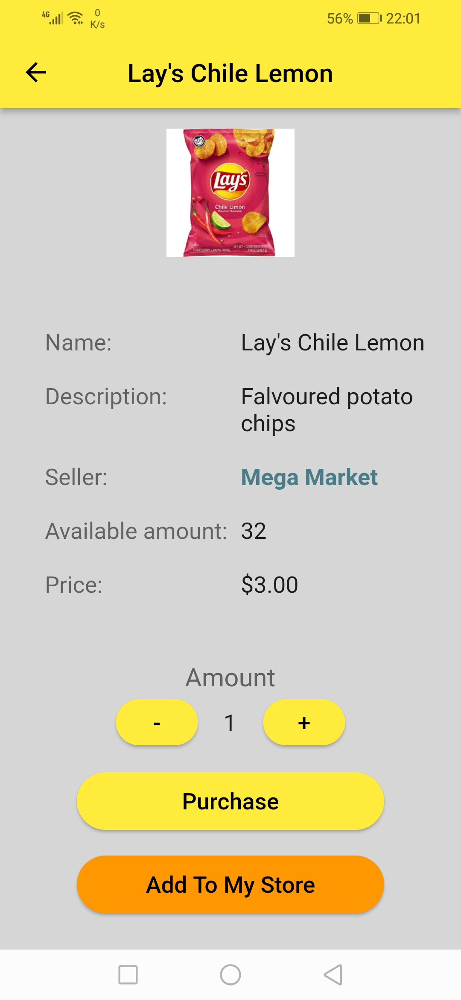
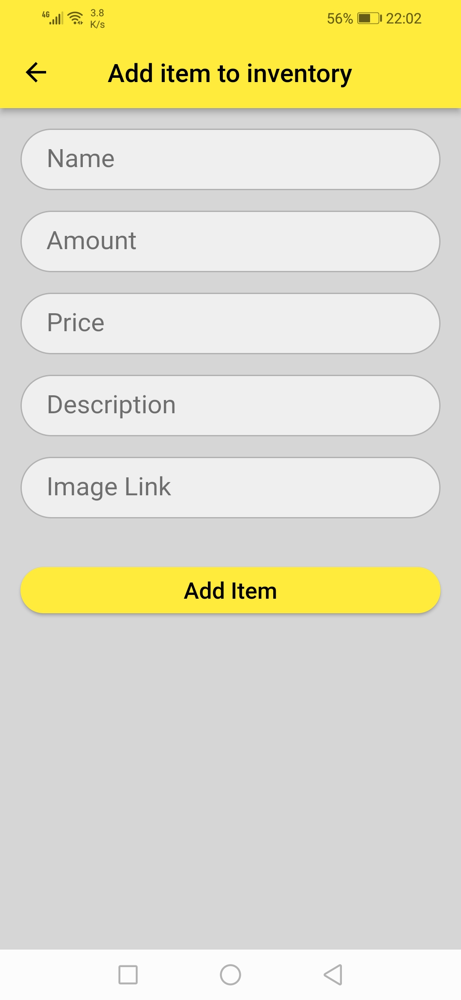

# Nexus Marketplace

A marketplace application that connects vendors to their customers. Vendors can store products in their accounts and put them in their stores for sale.
Also vendors can preview other vendors products in their store.

## Branches
`master`: Used provider package for state management and http for requests.
`applying-clean-architecture`: Used mvvm pattern in the application. Also i didn't use any state management in this branch, only depended on view models to handle the data of the views.
`riverpod-cubit`: Used riverpod state management in a way similar to cubit in bloc package.
Also used dio for making requests, retrofit for generating requests code, repository pattern, dependency injection using Get It.

## Used packages
* Flutter Riverpod
* Dio
* Retrofit
* Mockito
* Get It

## Screenshots
||||
|-|-|-|
||||
||||